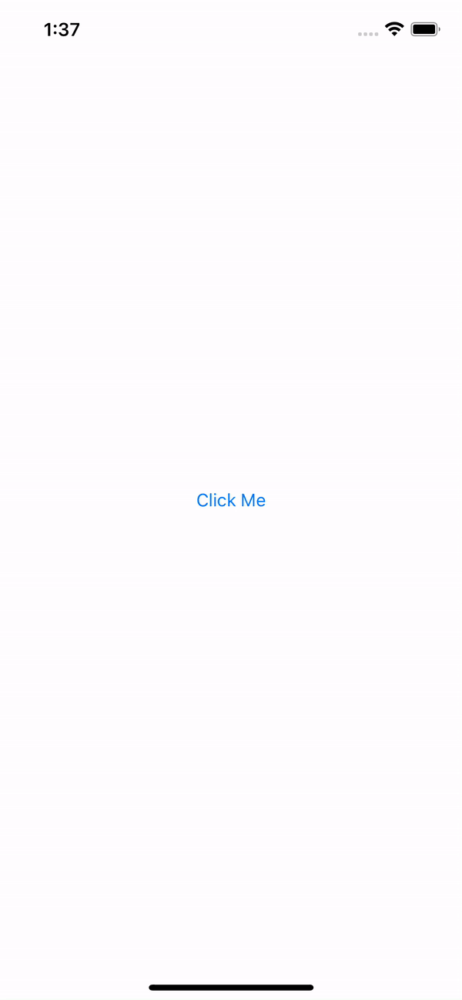

# UIBottomSheet

_This is not a library!_

This is a simple project to have a starter code to implement a custom bottom sheet and its transition animation. There are only two predefined types of sheet: `BottomSheetViewController` and `CardBottomSheetViewController`. They both use `BottomSheetPresentationController` for custom presentation. See the examples in the section below.

Because this is only starter files, you can tweak than to conform to you own project patterns.

## Usage

BottomSheetViewController             |  CardBottomSheetViewController
:-------------------------:|:-------------------------:
  |  

#### Call viewController
```swift
  let bottomSheetVC = BottomSheetViewController()     // or CardBottomSheetViewController()
  // You can expose any property in BottomSheetViewController and set it in here.
  // bottomSheetVC.sheetHeight = 400
  // bottomSheetVC.sheetBackgroundColor = .white
  // bottomSheetVC.sheetCornerRadius = 22

  bottomSheetVC.modalPresentationStyle = .custom
  bottomSheetVC.transitioningDelegate = self

  self.present(bottomSheetVC, animated: true)
```

#### Conform to UIViewControllerTransitioningDelegate

```swift
class MyViewController: UIViewControllerTransitioningDelegate {
  // ...
  // present desired bottom sheet
  // ...
  
  func presentationController(forPresented presented: UIViewController, presenting: UIViewController?, source: UIViewController) -> UIPresentationController? {
      BottomSheetPresentationController(presentedViewController: presented, presenting: presenting)
  }
}
```


## Compatibility

This was tested in `iOS 13+`, but I believe that with little to no change you can make it work with previous versions.
